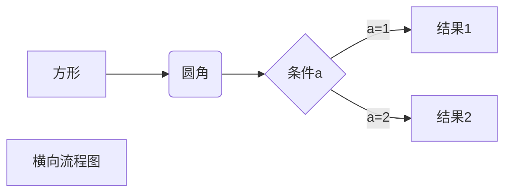
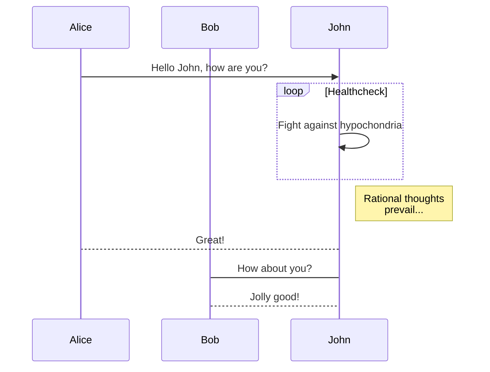
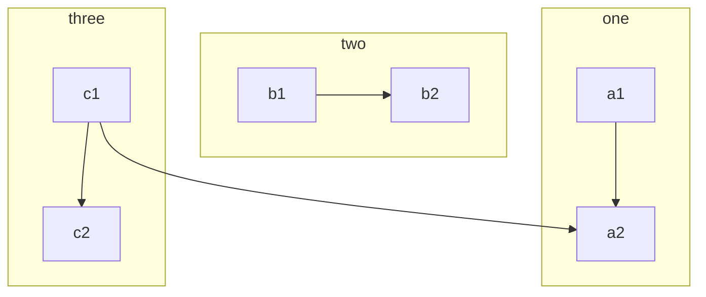

# Markdown 语法


## 标题


```markdown
# 一级标题
## 二级标题
### 三级标题
#### 四级标题
##### 五级标题
###### 六级标题
```

# 一级标题

## 二级标题
### 三级标题
#### 四级标题
##### 五级标题
###### 六级标题


## 段落格式

### 字体

```markdown
*斜体* _斜体_
**粗体** __粗体__
***粗斜体*** ___粗斜体___
~~删除线~~
<u>下划线</u>
分割线 
*** 
---
脚注[^Come on] 
[^Come on]: just do it
```

*斜体* _斜体_
**粗体** __粗体__
***粗斜体*** ___粗斜体___
~~删除线~~
<u>下划线</u>

---


分割线 

***


脚注[^Come on] 


## 列表

```markdown
无序列表 使用(*)\(+)\(-),这些标记之后要添加一个空格
* 无序1
* 无序2
* 无序3
有序列表 使用数字+（。）
1. 有序1
2. 有序2
3. 有序3
列表嵌套 在子列表前加4给空格
* 第一层
    1. 第一层 第一项
    2. 第一层 第二项
* 第二层
    * 第二层 第一项
    * 第二层 第二项
```

无序列表 使用(*)\(+)\(-),这些标记之后要添加一个空格
* 无序1
* 无序2
* 无序3

有序列表 使用数字+（。）

1. 有序1
2. 有序2
3. 有序3

列表嵌套 在子列表前加4给空格
* 第一层
    1. 第一层 第一项
    2. 第一层 第二项
* 第二层
    * 第二层 第一项
    * 第二层 第二项


## 区块

```markdown
Markdown 区块引用是在段落开头使用 > 符号 ，然后后面紧跟一个空格符号：
> 要点1
> 要点2

另外区块是可以嵌套的，一个 > 符号是最外层，两个 > 符号是第一层嵌套，以此类推：
> 第一层
>> 第二层
>>> 第三层

如果要在列表项目内放进区块，那么就需要在 > 前添加四个空格的缩进。
* 第一项
    >区块1
    >区块2
* 第二项
    >区块3
    >区块4
```

> 要点1
> 要点2

---

> 第一层
> > 第二层
> >
> > > 第三层

---

* 第一项
    >区块1
    >区块2
* 第二项
    >区块3
    >区块4

---

## 代码

```markdown
如果是段落上的一个函数或片段的代码可以用反引号把它包起来（`），例如：`printf()` 函数

用``` 包裹一段代码，并指定一种语言（也可以不指定）
​```javascript
$(document).ready(function () {
    alert('RUNOOB');
});
​```
```

` printf() `函数

```javascript
$(document).ready(function () {
    console.log('everything is ready');
});
```

---

## 链接

```markdown
[链接名称](链接地址) 或者 <链接地址>
```

[百度](https://www.baidu.com)

<https://www.baidu.com>

视频网站：[YouToBe][youtube]

---

## 图片

```markdown
开头一个感叹号 !
接着一个方括号，里面放上图片的替代文字
接着一个普通括号，里面放上图片的网址，最后还可以用引号包住并加上选择性的 'title' 属性的文字。


Markdown 还没有办法指定图片的高度与宽度，如果你需要的话，你可以使用普通的  标签。

```


[]((https://www.runoob.com/))


---

## 表格

```markdown
Markdown 制作表格使用 | 来分隔不同的单元格，使用 - 来分隔表头和其他行。
-: 设置内容和标题栏居右对齐。
:- 设置内容和标题栏居左对齐。
:-: 设置内容和标题栏居中对齐。
|  表头   | 表头  |
|  ----  | ----  |
| 单元格  | 单元格|
| 单元格  | 单元格 |
```


| 表头   |  表头  |
| ------ | :----: |
| 单元格 | 单元格 |
| 单元格 | 单元格 |


---

## 高级

```markdown
不在 Markdown 涵盖范围之内的标签，都可以直接在文档里面用 HTML 撰写。

Markdown 使用了很多特殊符号来表示特定的意义，如果需要显示特定的符号则需要使用转义字符，Markdown 使用反斜杠转义特殊字符：

```

使用 <kbd>Ctrl</kbd>+<kbd>Alt</kbd>+<kbd>Del</kbd> 重启电脑

**文本加粗** 
\*\* 正常显示星号 \*\*

```
当你需要在编辑器中插入数学公式时，可以使用两个美元符 $$ 包裹 TeX 或 LaTeX 格式的数学公式来实现。提交后，问答和文章页会根据需要加载 Mathjax 对数学公式进行渲染。如：
$$
\mathbf{V}_1 \times \mathbf{V}_2 =  \begin{vmatrix} 
\mathbf{i} & \mathbf{j} & \mathbf{k} \\
\frac{\partial X}{\partial u} &  \frac{\partial Y}{\partial u} & 0 \\
\frac{\partial X}{\partial v} &  \frac{\partial Y}{\partial v} & 0 \\
\end{vmatrix}
${$tep1}{\style{visibility:hidden}{(x+1)(x+1)}}
$$
```

$$
\mathbf{V}_1 \times \mathbf{V}_2 =  \begin{vmatrix} 
\mathbf{i} & \mathbf{j} & \mathbf{k} \\
\frac{\partial X}{\partial u} &  \frac{\partial Y}{\partial u} & 0 \\
\frac{\partial X}{\partial v} &  \frac{\partial Y}{\partial v} & 0 \\
\end{vmatrix}
${$tep1}{\style{visibility:hidden}{(x+1)(x+1)}}
$$




```flow
st=>start: 开始框
op=>operation: 处理框
cond=>condition: 判断框(是或否?)
sub1=>subroutine: 子流程
io=>inputoutput: 输入输出框
e=>end: 结束框
st->op->cond
cond(yes)->io->e
cond(no)->sub1(right)->op
```

```sequence
Title: 标题：时序图
对象A->对象B: 对象B你好吗?（请求）
Note right of 对象B: 对象B的描述
Note left of 对象A: 对象A的描述(提示)
对象B-->对象A: 我很好(响应)
对象B->小三: 你好吗
小三-->>对象A: 对象B找我了
对象A->对象B: 你真的好吗？
Note over 小三,对象B: 我们是朋友
participant C
Note right of C: 没人陪我玩
```

```mind
	思维导图字体颜色演示
		 . 说话的艺术
			#FF00ff 1.警告的话
			#44ff00 2. 温馨的话
			#229933 3. 关怀的话
			#ff3300 4. 强硬的话
		. 背景颜色
			##ff00ff 高兴的事情
			##ff9900 不开心的事
			##00ff88 悠闲的时光
		第三项 : 样例节点
```

---






# Hello World!！


```markdown
# Hello World! 
```

# aa

## bb

w

[^Come on]:just do it

[youtube]:https://www.youtube.com

